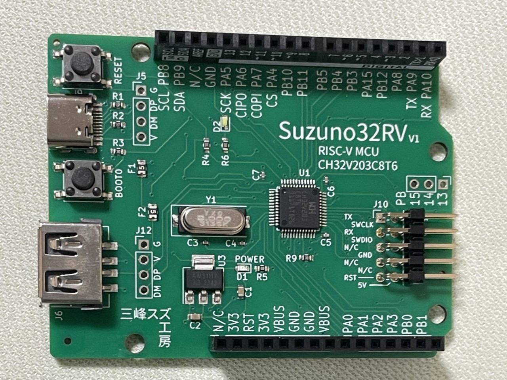
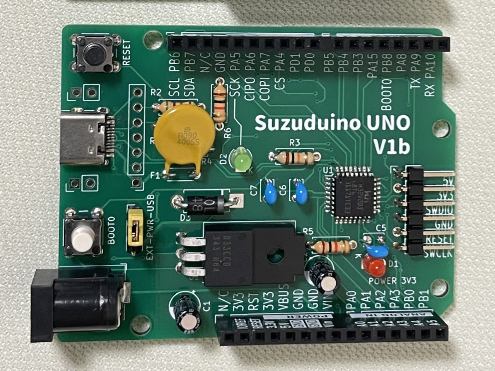

# Suzuno32RV / Suzuduino UNO 解説ドキュメント

Suzuno32RV / Suzuduino UNO は、WCH CH32Vチップを搭載したマイコンボードのシリーズです。32bit RISC-Vを搭載した、小さくてパワフルなマイコンチップを探検しましょう！

Suzuduino UNOは手作業の実装も可能な、スルーホール部品を主体にした構成です。

Suzuno32RVにはUSB Type-Aコネクタを実装し、USBホスト機能にも挑戦できます。

## 目次

 - [まずは使ってみよう Lチカ](getstarted.html)
 - [基本仕様](specs.html)
 - [ボードの種類](variations.html)
 - [開発環境](devenvs.html)
 - [情報リソース](resources.html)
 - [USBデバイスの開発](usbdevicedev.html)
 - [USBホストの開発](usbhostdev.html)
